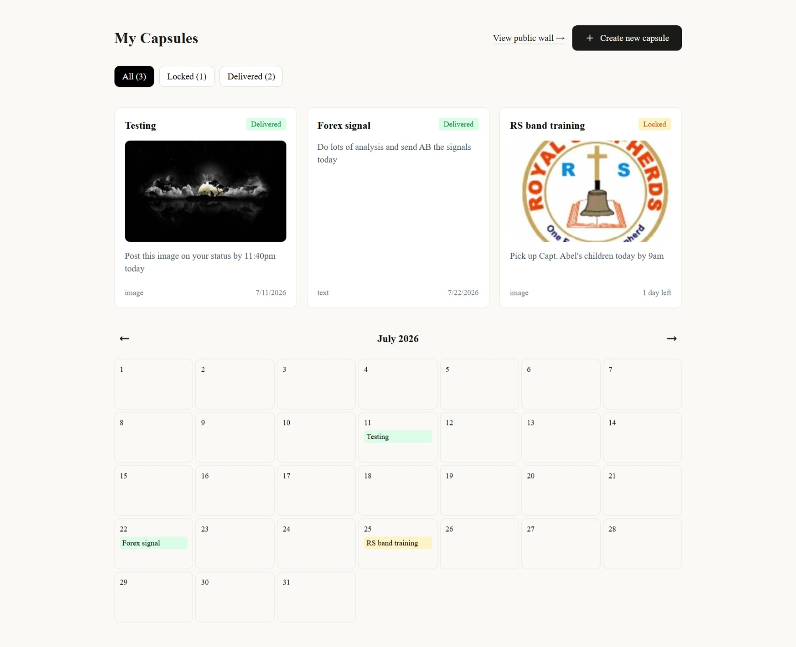
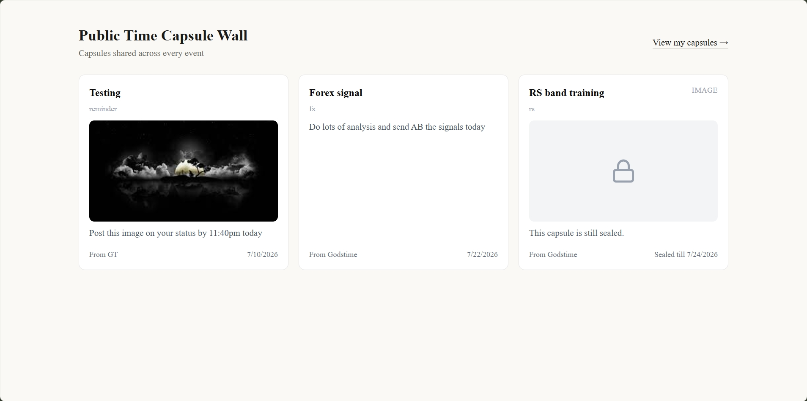

# Scheduled Message Time Capsule

**Live demo:** [scheduledmessage.vercel.app](https://scheduledmessage.vercel.app)

A web app for sending time-locked messages to the future. Create a text, image, audio, or video "capsule," pick a delivery date, and it gets automatically emailed to the recipient once that date arrives. Capsules can also be marked public and shared on a time-capsule wall, either scoped to a specific event or browsed across all events.

## Screenshots

| Dashboard                                          | Public Wall                                         |
| -------------------------------------------------- | --------------------------------------------------- |
|  |  |

## Tech Stack

- **Next.js (App Router)** + TypeScript
- **Tailwind CSS**
- **Supabase** — Postgres database, Row Level Security, and file storage
- **Resend** — transactional email delivery
- **Serwist** — service worker / PWA support

## Features

- Create capsules with text, image, audio, or video content
- Drag-and-drop calendar to schedule/reschedule delivery dates
- Automatic email delivery once a capsule's date is reached
- Public time-capsule wall; view all public capsules, or filter to a specific event tag
- Sealed content hidden on the wall until a capsule is actually delivered
- Dashboard to track locked vs. delivered capsules, with live counts per status
- Installable as a Progressive Web App

## Folder Structure

```
app/
  page.tsx                       Landing page — capsule creation form
  dashboard/
    page.tsx                     "My Capsules" dashboard
  wall/
    page.tsx                     Public wall — all events
    [eventTag]/
      page.tsx                   Public wall — single event
  api/
    deliver/
      route.ts                   Server route — sends delivery emails via Resend
  sw.ts                          Service worker source (built by Serwist)

components/
  capsule/
    CapsuleForm.tsx               Capsule creation form (incl. media upload)
    CapsuleDashboard.tsx          Dashboard state, filters, delivery check
    CapsuleCard.tsx               Single capsule display (owner view)
    DeliveryBadge.tsx             Locked/Delivered status pill
    DateScheduler.tsx             Drag-and-drop delivery date calendar
  wall/
    WallGrid.tsx                  Public wall grid layout
    WallCapsuleCard.tsx           Public capsule display (gated by delivery status)
    SafeImage.tsx                 Client component handling broken image fallback

lib/
  supabase.ts                     Supabase client setup
  capsules.ts                     Capsule CRUD + camelCase/snake_case mapping
  delivery.ts                     Checks due capsules, triggers email, marks delivered

types/
  capsule.ts                      Shared Capsule types

public/
  manifest.json                   PWA manifest
  icons/                          PWA install icons
  screenshots/                    README screenshots
```

## Setup

1. Create a Supabase project and run the schema (table, storage bucket, RLS policies)
2. Create a Resend account and get an API key
3. Add environment variables to `.env.local`:
   ```
   NEXT_PUBLIC_SUPABASE_URL=
   NEXT_PUBLIC_SUPABASE_ANON_KEY=
   RESEND_API_KEY=
   ```
4. Install dependencies and run the dev server:
   ```
   npm install
   npm run dev
   ```
5. To test PWA installability, build and run a production build (Serwist doesn't activate in dev mode):
   ```
   npm run build
   npm run start
   ```

## Known Limitations

- Email delivery is functional but currently restricted to the developer's own inbox (sundaygodstimegt1@gmail.com), pending domain verification with Resend
- Delivery emails are checked and sent when the dashboard loads, not via a real background scheduler (no cron job yet) — if no one opens the app, a due capsule won't send until the app is next visited
- RLS policies are open for demo purposes and not tied to real user authentication
- Only email delivery is implemented; SMS and push channels are defined in the schema but not yet wired up
- Sealed content on the public wall is hidden at the UI level only — the underlying data isn't withheld at the query level, so this isn't airtight against direct inspection
